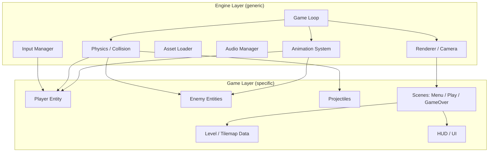
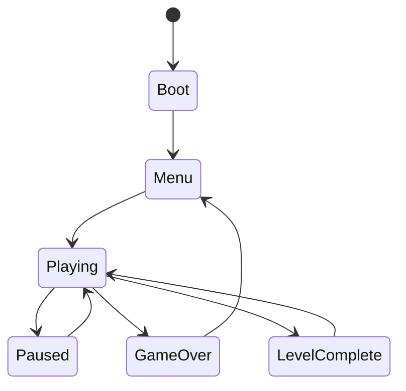
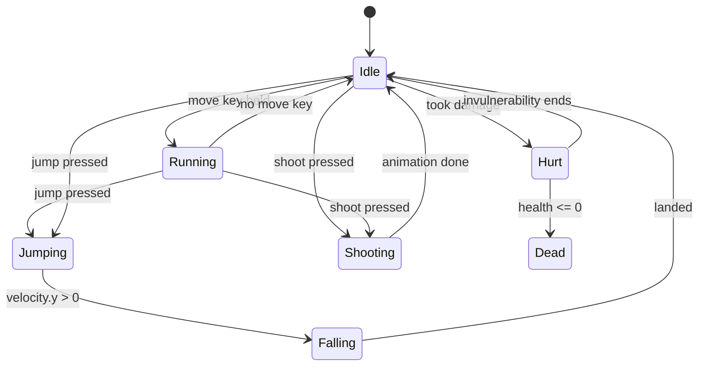

# 02 — Architecture & Design

## Two layers: Engine vs. Game

Split my code into two conceptual layers from day one. It's the single
highest-leverage architectural decision I'll make.

- **Engine layer** — generic, reusable, knows nothing about "Hopper" or
  "the Grump." Handles the game loop, input, rendering, camera, audio,
  asset loading, collision math. I could reuse this layer for a completely
  different game.
- **Game layer** — everything specific to *this* game: the player entity,
  enemy behaviors, level data, HUD, win/lose rules.



## The game loop

Everything is driven by one loop, called roughly 60 times a second via
`requestAnimationFrame`. Each tick does exactly two things, in order:

1. **Update** — advance the simulation by `deltaTime` (input → physics →
   collision → animation → game rules).
2. **Render** — draw the current state to the canvas. Rendering never changes
   game state; it only reads it.

Keeping "update" and "render" strictly separate is what lets me pause,
slow-motion, or add a spectator/replay mode later without rewriting anything.

```js
// engine/core/Loop.js
class Loop {
  constructor(update, render) {
    this.update = update;
    this.render = render;
    this.lastTime = 0;
    this.running = false;
  }

  start() {
    this.running = true;
    requestAnimationFrame(this._tick.bind(this));
  }

  _tick(currentTime) {
    if (!this.running) return;
    const dt = Math.min((currentTime - this.lastTime) / 1000, 0.1); // seconds, clamped
    this.lastTime = currentTime;

    this.update(dt);
    this.render();

    requestAnimationFrame(this._tick.bind(this));
  }
}
```

The `Math.min(..., 0.1)` clamp is important: if the tab loses focus for a few
seconds, `dt` would otherwise spike and teleport the player through walls.
See `05-game-loop-and-physics.md` for the fixed-timestep variant.

## Entities: composition over deep inheritance

A tempting first design is a class hierarchy: `Entity → Character → Player`,
`Entity → Character → Enemy`. This gets painful fast (what about an enemy that
shoots? Multiple inheritance doesn't exist in JS). Instead, favor **small,
composable pieces of data and behavior** attached to a plain entity:

```js
// A "plain data" style entity — not deep inheritance
class Entity {
  constructor() {
    this.position = new Vector2(0, 0);
    this.velocity = new Vector2(0, 0);
    this.size = { width: 16, height: 16 };
    this.sprite = null;      // SpriteSheet reference
    this.animator = null;    // current animation state
    this.collider = null;    // AABB collision box
    this.health = null;      // { current, max } or null if invulnerable
    this.tags = new Set();   // e.g. 'player', 'enemy', 'projectile'
    this.alive = true;
  }
  update(dt, world) { /* overridden per entity type */ }
}
```

This is a lightweight version of the **Entity-Component-System (ECS)**
pattern without the ceremony of a full ECS library — plenty for a game of
this size. If the project grows much larger (many entity types, many
systems), a real ECS library becomes worth it, but start simple.

## Finite State Machines (FSM) — used twice

State machines show up in two different places and are worth understanding
well:

**1. Game-level states** (which "scene" is active):



**2. Character-level states** (drives both behavior *and* animation):



A single character state feeds directly into which animation clip plays —
this is the link between `05-game-loop-and-physics.md` (what state I'm in)
and `06-animation-system.md` (what that looks like on screen).

## Systems

Rather than each entity fully managing itself, small systems operate *across
all entities* each frame. This keeps concerns separated and makes each piece
individually testable.

| System | Responsibility |
|---|---|
| `InputManager` | Tracks which keys are currently down; exposes `isDown('left')` etc. Nothing else touches raw keyboard events. |
| `PhysicsSystem` | Applies gravity/velocity to every entity's position. |
| `CollisionSystem` | Tests entities against the tilemap and each other; resolves overlaps. |
| `AnimationSystem` | Advances each entity's current animation frame based on `dt`. |
| `CameraSystem` | Follows the player, clamped to level bounds. |
| `RenderSystem` | Draws background → tiles → entities → UI, in that order (painter's algorithm). |
| `AudioManager` | Plays one-shot SFX and looping music, respects a mute flag. |

## Decoupling with an event bus (Observer pattern)

Instead of the collision system directly calling `hud.addScore()` and
`audio.play('coin')` and `particles.spawn()` inline, emit an event and let
interested systems listen. This avoids tangled cross-references between
unrelated systems.

```js
// engine/core/EventBus.js
class EventBus {
  constructor() { this.listeners = new Map(); }
  on(event, handler) {
    if (!this.listeners.has(event)) this.listeners.set(event, []);
    this.listeners.get(event).push(handler);
  }
  emit(event, payload) {
    (this.listeners.get(event) || []).forEach(fn => fn(payload));
  }
}

// usage
events.on('enemyDefeated', ({ enemy, points }) => {
  hud.addScore(points);
  audio.play('stomp');
  particles.spawnPuff(enemy.position);
});
```

## Rendering order (painter's algorithm)

Draw back-to-front so nearer things naturally cover farther things — no
z-index system needed for a 2D platformer:

1. Sky/background color or gradient
2. Parallax background layers (far → near)
3. Tilemap (level geometry)
4. Entities (enemies, pickups, player, projectiles) — sorted by Y if I want
   pseudo-depth, optional for a platformer
5. Particles/effects
6. HUD (score, health, lives) — drawn last, in screen space (not world space)

## Design principle summary

- **Separate update from render.** Update advances state; render only reads it.
- **Favor composition over inheritance** for entities.
- **Push cross-cutting behavior into systems**, not into individual entities.
- **Use events to decouple** systems that don't need to know about each other.
- **State machines** for anything with distinct "modes" (game state, character
  state, enemy AI phases, UI screens).

Next: `03-file-structure.md`.
